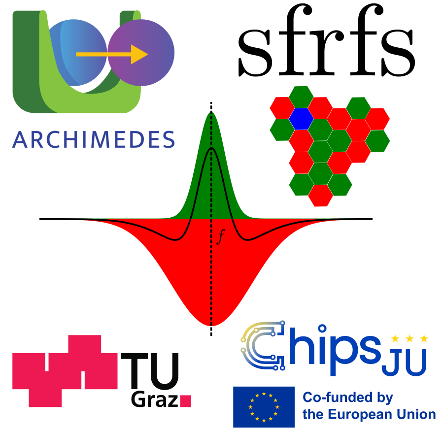
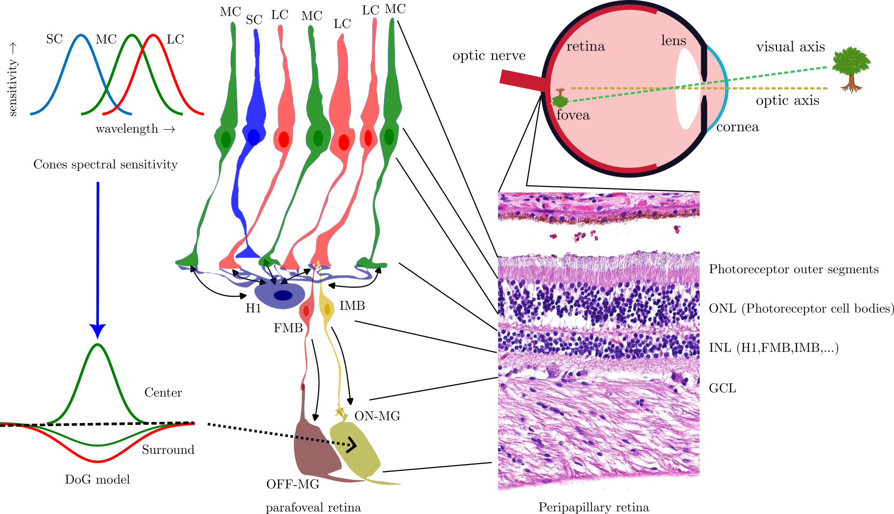
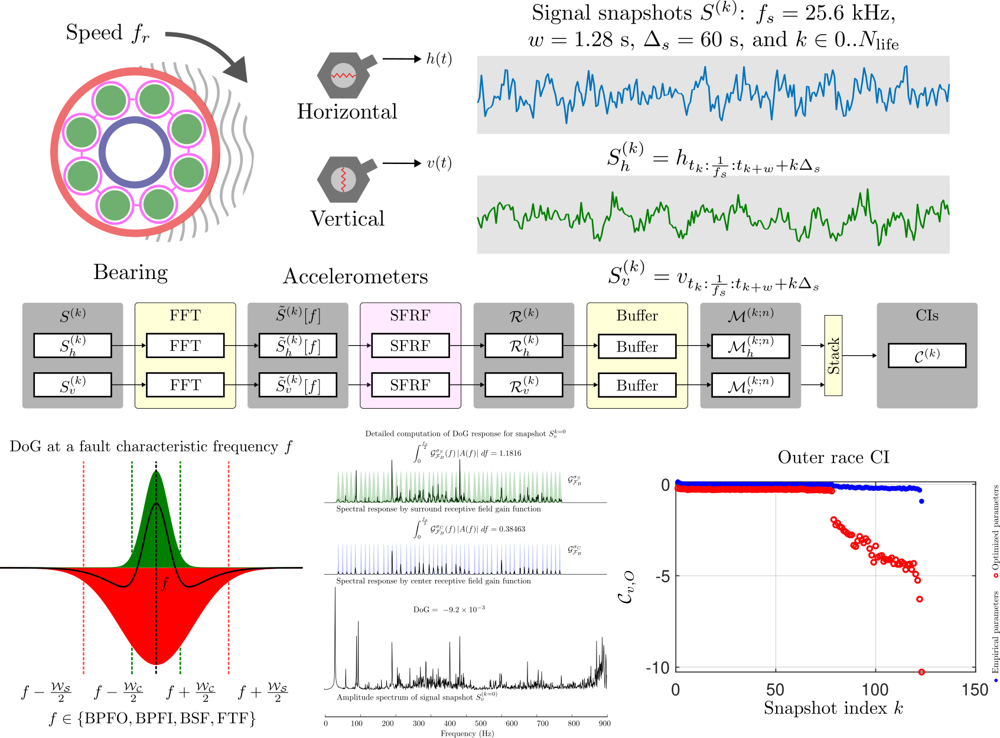

# Spectral Fault Receptive Fields (SFRFs) Toolbox for MATLAB

This toolbox provides an implementation of **Spectral Fault Receptive Fields 
(SFRFs)** for condition monitoring and prognosis.
<div align="center">
  
</div>

## What are SFRFs?

Spectral Fault Receptive Fields (SFRFs) are a computational framework inspired
by the concept of receptive fields in the retinal ganglion cells of primates. 
In condition monitoring and prognosis, SFRFs analyze spectral features of
signals to capture degradation patterns as they manifest in _characteristic
frequency bands_. 
They act as optimized contrast filters linking spectral patterns with machine 
conditions, supporting diagnosis-informed prognosis.

## Biological Inspiration

<div align="center">
  
</div>
Figure 1: Center-surround receptive field organization in primate retinal 
ganglion cells. The inset (top left) shows the spectral sensitivity peaks of 
cone photoreceptors at different wavelengths. The retinal architecture computes 
receptive fields in ganglion cells responsible for encoding visual images. A 
receptive field defines the region of the visual field (top right) where light 
stimulation modulates the firing rate of a ganglion cell. In the figure, photons 
are transduced by photoreceptor cells (only cones are depicted here) that excite 
or inhibit bipolar cells. Horizontal cells feedback surround information that 
antagonizes the forward propagation of information. This neural circuitry 
generates chromatic contrast-sensitive responses, particularly in midget 
ganglion cells, facilitating edge detection and color discrimination. The 
transformation in the direction of the arrow is often modeled with a difference 
of Gaussians model where a spatially sharp center is antagonized by a smooth 
wider-spanning surround (bottom left). Micrograph inset modified from 
<a href="https://commons.wikimedia.org/wiki/File:Retina_%2D%2D_intermed_mag.jpg#/media/File:Retina_%2D%2D_high_mag.jpg">Librepath 2015</a> - Wikimedia Commons.


According to the trichromatic theory of vision, the receptive fields of midget
ganglion cells have a center-surround organization:

- **Center:** Depending on the type of glutamate receptors in the bipolar cells 
and the type of cone afferent to the bipolar cell, the center can excite or 
inhibit the activation of the bipolar cell.
- **Surround:** The surround is elicited by the activity of horizontal cells, 
which connect to multiple cone afferents over a broader spatial extent than the 
center. 
The surround acts in opposition to the center: if the center activates with 
light (ON channel), the surround inhibits the response, and vice versa (OFF 
channel).

By this mechanism, bipolar cells also exhibit center-surround receptive fields 
and can be modeled similarly. The main difference with ganglion cells is that 
bipolar cell responses are continuous (not encoded in action potentials, as in 
midget ganglion cells).

## SFRFs as condition indicators

Our general objective is to engineer health 
perception systems capable of actively tracking the degradation state of 
bearings to enable accurate prediction of their Remaining Useful Life (RUL).

SFRFs can be the basis of health monitoring systems, characterizing degradation
trends. Our qualitative study explores its applicability to condition monitoring
and prognosis of rolling bearings. 

The following figure illustrates the processing pipeline for SFRFs.
<div align="center">
  
</div>
Figure 2: Processing pipeline. Degradation manifests as increased vibrations of
the system. Horizontal and vertical accelerations are used to compute SFRFs as
"frequency contrast" indicators by integrating the accelerometer readings around
the well-known characteristic frequencies associated with different bearing
fault modes. The processing pipeline first computes the FFT of the signals. 
Characteristic harmonics and sidebands are then monitored using Gaussian
frequency filters, with the surround spatially (in the frequency axis) broader
than the center. The difference of the resulting numerical integrals is 
obtained, and the resulting values are stacked in a memory buffer from which
RUL estimation can be performed.

## Installation

You can install the **SFRFs Toolbox** in three different ways.

### 1. Install from the GitHub repository (recommended)

Clone or download the project:

```bash
git clone git@github.com:stanmoon/matlab-sfrfs.git
```

In MATLAB, run the installation script:

```matlab 
sfrfs_install
```

Alternatively, you can install the packaged toolbox by double-clicking
sfrfs.mltbx inside the dist folder.

---

### 2. Install from Zenodo (archived release)

A versioned, citable release of the SFRFs Toolbox is available on Zenodo:

[](https://doi.org/10.5281/zenodo.17631784)

The Zenodo record includes:

- The packaged MATLAB toolbox (`.mltbx`)  
- A source-code snapshot for this version  
- Static documentation  

Download the `.mltbx` file and install it directly in MATLAB by 
double-clicking it.

---

### 3. Install via MATLAB Add-On Explorer (MathWorks File Exchange)

Available on MathWorks File Exchange:

1. In MATLAB, open **Home → Add-Ons → Explore Add-Ons**  
2. Search for **"Spectral Fault Receptive Fields"**  
3. Click **Install**

---

## Test installation

Verify that the toolbox is functional by running the unit tests:

```matlab
runtests('Spectral Fault Receptive Fields/tests')
```

## Uninstallation

If you no longer need the SFRFs Toolbox, you can remove it cleanly from MATLAB using the provided uninstall script.

From the toolbox root folder, run:

```matlab
uninstall_sfrfs
```

Alternatively, you can also uninstall it through the Add-On Manager:

Home → Add-Ons → Manage Add-Ons, (Manage), then locate
"Spectral Fault Receptive Fields" and select the uninstall option.

---
## Documentation

The toolbox includes both **interactive Live Script notebooks** and **static HTML documentation**.

- The **interactive notebooks** (`.mlx`) are the primary source of examples, explanations, and API usage.
- The **static HTML documentation** is generated automatically from these notebooks using MATLAB's publishing tools.

### Generate the static documentation

If you are working with a cloned repository, you can regenerate the full HTML documentation by running:

```matlab
doc_sfrfs
```
This script collects all .interactive notebooks rendering them in HTML 
format. The entry point is doc/html/SFRFsGuide.html.

---
## Advanced: customizing SFRFs logging

By default, the SFRFs Toolbox writes log files using Java's
`java.util.logging.SimpleFormatter`. This provides a standard, readable
format without requiring any configuration from the user.

For most users, the default format is sufficient and **no action is required**.

Power users who want to change the log line format can customize the formatter by setting
the JVM system property:

`java.util.logging.SimpleFormatter.format`

before starting MATLAB. One way to do this is via the `_JAVA_OPTIONS`
environment variable, for example on Linux:

```bash
export _JAVA_OPTIONS='-Djava.util.logging.SimpleFormatter.format="%1$tF %1$tT %4$s %3$s %5$s%6$s%n"'
```

---
## Further reading

For further theoretical background and computational methods, see:

- Stan Muñoz Gutiérrez and Franz Wotawa. Optimized Spectral Fault Receptive
Fields for Diagnosis-Informed Prognosis. In 36th International Conference on
Principles of Diagnosis and Resilient Systems (DX 2025). Open Access Series in
Informatics (OASIcs), Volume 136, pp. 9:1-9:20, Schloss Dagstuhl –
Leibniz-Zentrum für Informatik (2025) 
[DOI:10.4230/OASIcs.DX.2025.9](https://doi.org/10.4230/OASIcs.DX.2025.9).
 
- Stan Muñoz Gutiérrez and Franz Wotawa. A Qualitative Study on the 
Applicability and Optimization of Spectral Fault Receptive Fields for Condition
Monitoring and Prognosis (1.0). Zenodo. (2025)
[DOI:10.5281/zenodo.15660819](https://doi.org/10.5281/zenodo.15660819)

## Toolbox OOP design
SFRFs toolbox is an object-oriented implementation in MATLAB.  
A summary of the classes can be explored [here](devel/README.md).


## License

This project is licensed under the MIT License.
See the LICENSE.txt file for details.

## Funding

<div style="display: flex; align-items: center;">
  
  
</div> 

This study was conducted within the framework of the ARCHIMEDES project, which
is supported by the Chips Joint Undertaking and its members, including top-up
funding from National Authorities under Grant Agreement No. 101112295 and the
FFG under Grant Agreement No. FO999899377.


## Copyright

© 2025 Stan Muñoz Gutiérrez and Franz Wotawa

