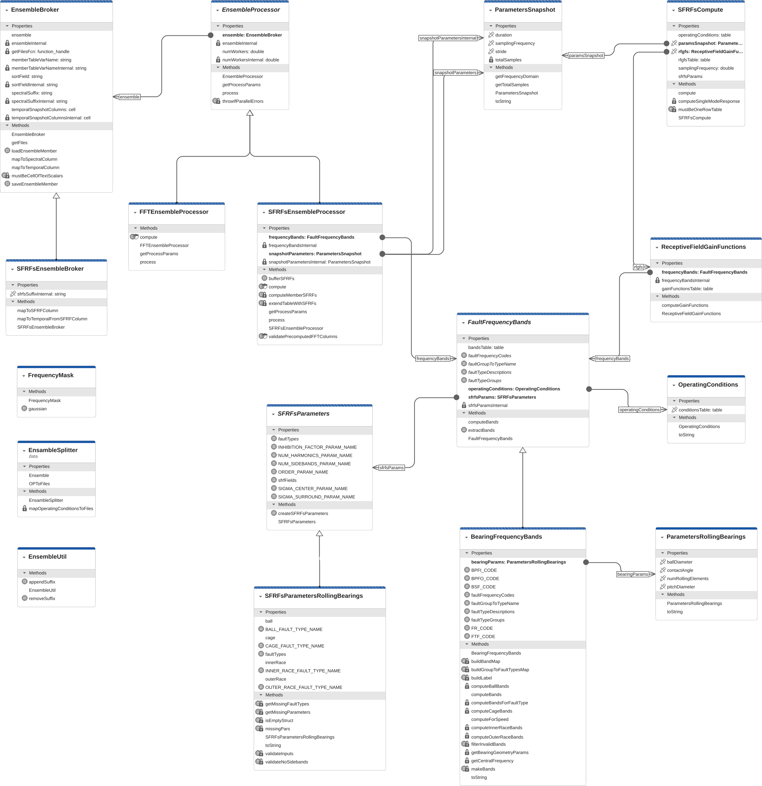

# Development Folder Overview

This `devel` folder contains development-related materials for the MATLAB 
**SFRFs Toolbox**, including architectural diagrams, functional 
classification of files, and an alphabetical index.

## Toolbox Architecture Summary

Figure 1. Class diagram with the functional classes for SFRFs computation.

[icon]: source-icon.svg "MATLAB Source Code"

---

## High-Level Class and Function Overview

This section lists toolbox components as belonging to different categories.

### **Dataset Handling**

- [![MATLAB Source Code][icon]](../toolbox/+data/createXJTUSYEnsemble.m)
  [**createXJTUSYEnsemble**](#createXJTUSYEnsemble) - Create and configure a `fileEnsembleDatastore` 
  for the XJTU-SY dataset.

- [![MATLAB Source Code][icon]](../toolbox/+data/getXJTUSYEnsemble.m)
  [**getXJTUSYEnsemble**](#getXJTUSYEnsemble) - Retrieve an already-registered XJTU-SY ensemble.

### **Core Data Objects**

- [![MATLAB Source Code][icon]](../toolbox/ParametersRollingBearings.m)
  [**ParametersRollingBearings**](#ParametersRollingBearings) - Stores rolling-bearing geometry and 
  physical parameters.

- [![MATLAB Source Code][icon]](../toolbox/OperatingConditions.m)
  [**OperatingConditions**](#OperatingConditions) - Represents speed/load operating points.

- [![MATLAB Source Code][icon]](../toolbox/ParametersSnapshot.m)
  [**ParametersSnapshot**](#ParametersSnapshot) - Sampling frequency, duration, stride, and derived 
  frequency axis.

### **Frequency Band Modelling**

- [![MATLAB Source Code][icon]](../toolbox/FaultFrequencyBands.m)
  [**FaultFrequencyBands**](#FaultFrequencyBands) - Abstract definition of characteristic 
  fault-frequency bands.

- [![MATLAB Source Code][icon]](../toolbox/BearingFrequencyBands.m)
  [**BearingFrequencyBands**](#BearingFrequencyBands) - Computes bearing-specific fault frequencies 
  from geometry and operating conditions.

### **RFGFs Computation**

- [![MATLAB Source Code][icon]](../toolbox/FrequencyMask.m)
  [**FrequencyMask**](#FrequencyMask) - Frequency-domain masks (for example, Gaussian masks).

- [![MATLAB Source Code][icon]](../toolbox/ReceptiveFieldGainFunctions.m)
  [**ReceptiveFieldGainFunctions**](#ReceptiveFieldGainFunctions) - Converts frequency bands into 
  center-surround gain masks.

### **SFRF Computation**

- [![MATLAB Source Code][icon]](../toolbox/SFRFsCompute.m)
  [**SFRFsCompute**](#SFRFsCompute) - Main engine computing SFRFs from temporal or spectral 
  data.

- [![MATLAB Source Code][icon]](../toolbox/SFRFsParameters.m)
  [**SFRFsParameters**](#SFRFsParameters) - Generic SFRF parameter definition.

- [![MATLAB Source Code][icon]](../toolbox/SFRFsParametersRollingBearings.m)
  [**SFRFsParametersRollingBearings**](#SFRFsParametersRollingBearings) - SFRF parameters for rolling-bearing 
  faults.

### **Ensemble Processing**

- [![MATLAB Source Code][icon]](../toolbox/EnsembleBroker.m)
  [**EnsembleBroker**](#EnsembleBroker) - Manages ensemble metadata and temporal/spectral 
  column mapping.

- [![MATLAB Source Code][icon]](../toolbox/SFRFsEnsembleBroker.m)
  [**SFRFsEnsembleBroker**](#SFRFsEnsembleBroker) - SFRF-specialized column management.

- [![MATLAB Source Code][icon]](../toolbox/EnsembleProcessor.m)
  [**EnsembleProcessor**](#EnsembleProcessor) - Abstract base for row-wise ensemble processing.

- [![MATLAB Source Code][icon]](../toolbox/FFTEnsembleProcessor.m)
  [**FFTEnsembleProcessor**](#FFTEnsembleProcessor) - Computes FFT representations.

- [![MATLAB Source Code][icon]](../toolbox/SFRFsEnsembleProcessor.m)
  [**SFRFsEnsembleProcessor**](#SFRFsEnsembleProcessor) - Computes SFRFs across ensemble members.

### **Registry**

- [![MATLAB Source Code][icon]](../toolbox/EnsembleDatastoreRegistry.m)
  [**EnsembleDatastoreRegistry**](#EnsembleDatastoreRegistry) - Central registry for `fileEnsembleDatastore` 
  objects.

### **Utilities**

- [![MATLAB Source Code][icon]](../toolbox/EnsembleUtil.m)
  [**EnsembleUtil**](#EnsembleUtil) - Suffix manipulation and related utility functions.

### **Logging & Diagnostics**

- [![MATLAB Source Code][icon]](../toolbox/SFRFsLogger.m)
  [**SFRFsLogger**](#SFRFsLogger) - Centralized logging and per-worker trace output.

---

# Classes

### createXJTUSYEnsemble

Creates and configures a `fileEnsembleDatastore` for the XJTU-SY bearing 
dataset and prepares metadata for downstream processing.
[[Back](#createXJTUSYEnsembleItem)]

---

### getXJTUSYEnsemble

Retrieves a previously registered XJTU-SY ensemble.
[[Back](#getXJTUSYEnsembleItem)]

---

### EnsembleDatastoreRegistry

Central registry for managing `fileEnsembleDatastore` 
instances.

Key features:

- Persistent configuration of datasets.
- Allows registering and retrieving datasets by name.
- Facilitates reconfiguration of variables to accommodate newly 
  computed columns.

[[Back](#EnsembleDatastoreRegistryItem)]

---

### SFRFsLogger

Centralized logging utility for toolbox components, with optional 
per-worker log files.

Key features:

- Singleton design ensuring consistent logging across components.
- Supports message formatting, timestamps, and verbosity control.
- Worker-specific log file generation for parallel SFRF/FFT processing.
- Used by processors, frequency-band computation, and gain-function 
  modules.

[[Back](#SFRFsLoggerItem)]

---

### EnsembleBroker

Concrete wrapper class for arbitrary ensemble-like objects. 
`EnsembleBroker` encapsulates an ensemble object and delegates file 
retrieval to a user-provided function handle.

Key features:

- Wraps any ensemble object and delegates member file listing via a 
  customizable function handle.
- Stores metadata such as temporal snapshot column names, sorting field, 
  member table variable name, and spectral suffix.
- Provides methods to map temporal signal column names to their spectral 
  counterparts and vice versa.
- Includes static utility methods to save and load ensemble member tables 
  consistently in MATLAB MAT-files.
- Validates input arguments robustly, ensuring data integrity.

This class facilitates standardized access and processing of ensemble data 
in the SFRFs toolbox while maintaining adaptability to different data 
representations. 
[[Back](#EnsembleBrokerItem)]

---

### SFRFsEnsembleBroker

Subclass of `EnsembleBroker` tailored for Spectral Fault Receptive Fields 
specific operations. This class extends the base ensemble broker 
functionality by adding handling for SFRF column naming conventions.

Key features:

- Inherits all ensemble management and file retrieval capabilities from 
  `EnsembleBroker`.
- Introduces a suffix property (`_SFRFs` by default) for naming SFRFs 
  columns.
- Provides methods to map between temporal column names and their 
  corresponding SFRF spectral column names.
- Ensures seamless integration of SFRF-specific logic while leveraging the 
  data access infrastructure of the base class.

This class facilitates standardized handling and naming of SFRF spectral 
data within ensemble processing workflows. 
[[Back](#SFRFsEnsembleBrokerItem)]

---

### FrequencyMask

Utility class for generating frequency-domain masks.

Key features:

- Static methods to create masks (for example, Gaussian masks) over 
  specified frequency bands.
- Parameters include the frequency vector, band limits, bandwidth rules, 
  and optional normalization.
- Masks can be normalized to have an area of 1 for consistent scaling.
- Designed for extensibility to support additional mask shapes in the 
  future.

This class simplifies the creation and application of frequency-domain 
masks in spectral signal processing workflows.
[[Back](#FrequencyMaskItem)]

---

### EnsembleUtil

Static utility class providing helper methods for ensemble data processing.

Key features:

- Facilitates consistent naming conventions for spectral and 
  temporal data columns in ensemble tables.
- Includes error handling to ensure meaningful suffix operations.

This class centralizes common string manipulation operations.
[[Back](#EnsembleUtilItem)]

---

### EnsembleProcessor (Abstract)

Abstract base class defining the interface and core functionality for 
processing ensembles of data using parallel execution.

Key features:

- Manages a specified number of parallel workers to process ensemble 
  members efficiently.
- Requires subclasses to implement `getProcessParams` method, returning 
  struct parameters necessary for processing.
- Holds an `EnsembleBroker` instance to access ensemble data files and 
  metadata.
- Provides a `process` method that applies a given function handle to each 
  ensemble member file in parallel using MATLAB's `parfor`.
- Includes robust error handling with aggregated exception reporting from 
  parallel workers.
- Automatically manages parallel pool setup based on the configured number 
  of workers.
- Logs detailed processing information for traceability and debugging.

This class establishes a standardized, extensible foundation for parallel 
ensemble processing workflows within the toolbox.
[[Back](#EnsembleProcessorItem)]

---

### FFTEnsembleProcessor

Concrete subclass of `EnsembleProcessor` for parallel computation of FFTs 
on ensemble member signals.

Key features:

- Efficiently computes FFTs of temporal signal columns specified in the 
  ensemble's configuration.
- Uses the ensemble's temporal snapshot columns and spectral suffix to 
  automate input and output column naming.
- Supports parallel processing with configurable number of workers to speed
  up computation.
- Includes a static `compute` method performing the FFT on each temporal 
  column and storing results in corresponding spectral columns.
- Designed as a lightweight, extensible spectral preprocessing step within 
  the SFRFs toolbox.
- Constructor accepts number of workers and an `EnsembleBroker` instance 
  managing ensemble metadata and files.

This class provides a foundational FFT processing step tailored for 
ensemble signal data with parallel execution support. It also serves as a 
reference implementation of concrete ensemble processor subclasses, 
demonstrating best practices for extending the abstract 
`EnsembleProcessor`.
[[Back](#FFTEnsembleProcessorItem)]

---

### SFRFsEnsembleProcessor

Concrete subclass of `EnsembleProcessor` that processes ensemble data 
specifically for Spectral Fault Receptive Fields.

Key features:

- Manages parallel or sequential processing of ensemble members to compute 
  SFRF responses.
- Utilizes input parameters including frequency bands, snapshot details, 
  and receptive field gain functions.
- Computes SFRF responses for each temporal signal column and appends these
  as new columns in ensemble member tables.
- Validates the presence and correctness of precomputed FFT columns before 
  processing.
- Provides static utility for temporal buffering of SFRFs, stacking 
  response vectors over multiple time steps with NaN padding for missing 
  history.
- Integrates seamlessly with `SFRFsCompute` and 
  `ReceptiveFieldGainFunctions` for modular and extensible computation.
- Constructor requires configuration of the number of workers, 
  ensemble broker, frequency bands, and snapshot parameters.

This class embodies the core ensemble processing workflow for SFRF analysis
in the toolbox, leveraging parallel execution and modular component design.
[[Back](#SFRFsEnsembleProcessorItem)]

---

### SFRFsParameters (Abstract)

Abstract base class for storing and validating parameters related to 
Spectral Fault Receptive Fields.

Key features:

- Defines an abstract constant property `faultTypes` for subclasses to 
  specify relevant fault types.
- Provides a collection of constant parameter field names representing core 
  SFRF settings such as order, number of sidebands, harmonics, Gaussian 
  mask bandwidths, and inhibition factors.
- Implements a static factory method `createSFRFsParameters` to generate 
  validated parameter structs with sensible defaults and input validation.
- Designed to be extended by concrete subclasses which define 
  domain-specific fault parameters.

This class centralizes parameter handling for SFRF computations, promoting 
consistency and validation across fault type implementations. By its 
contract, subclasses must specify their fault types, enhancing structural 
design and ensuring consistency throughout the processing pipeline.
[[Back](#SFRFsParametersItem)]

---

### ParametersSnapshot

Class representing snapshot metadata for signal processing, encapsulating 
independent parameters related to sampling and snapshot timing.

Key properties:

- `samplingFrequency`: Sampling frequency in Hz.
- `duration`: Duration (seconds) of the snapshot window.
- `stride`: Time interval in seconds between consecutive snapshot start 
  times.

Key methods:

- Constructor initializes the properties with validation and logs a 
  formatted description.
- `getTotalSamples`: Returns the total number of samples in a snapshot, 
  caching the result for efficiency.
- `toString`: Provides a formatted string summarizing the snapshot 
  parameters.
- `getFrequencyDomain`: Computes the FFT frequency axis vector 
  corresponding to the snapshot length and sampling frequency.

This class encapsulates fundamental timing and sampling parameters 
essential for accurate spectral and time-domain signal processing.
[[Back](#ParametersSnapshotItem)]

---

### SFRFsCompute

Class responsible for performing Spectral Fault Receptive Field 
computations on input signals using configured receptive field gain 
functions and snapshot parameters.

Key features:

- Encapsulates `ParametersSnapshot` and `ReceptiveFieldGainFunctions` 
  objects, linking spectral parameters with processing functionality.
- Computes SFRF responses either from raw temporal snapshot data or 
  precomputed spectral data.
- Filters and validates operating conditions against available gain 
  functions to ensure appropriate fault band selection.
- Implements private methods to compute single-mode SFRF responses using 
  spectral masks and inhibition factors.
- Constructs detailed response tables associating each fault mode with its
  computed SFRF output.
- Provides robust input validation and error handling, including checks on
  FFT lengths and presence of required data columns.
- Includes static validation for input operating condition tables ensuring 
  correctness of input dimensions.

Typical usage involves instantiating the class with snapshot parameters and 
receptive field gain functions and then computing the SFRFs for a given 
signal and operating condition.

This class forms a core component for SFRF response calculation within the
spectral fault analysis pipeline.
[[Back](#SFRFsComputeItem)]

---

### FaultFrequencyBands (Abstract)

Abstract base class defining the structure and interface for characteristic 
fault frequency bands, independent of specific system or component.

Key features:

- Abstract constant properties specify fault frequency codes, fault 
  descriptions, groups, and mappings from groups to names.
- Concrete properties include operating conditions, SFRF parameters, and a
  table of computed fault bands.
- Abstract method `computeBands` must be implemented by subclasses to build 
  fault frequency band tables based on operating conditions.
- The fault bands table includes fields such as fault group, human-readable 
  descriptions, speed, load, and receptive field band definitions.
- Provides a static utility method `extractBands` to extract, sort, and 
  structure band matrices from a specified table row for easy usage.
- Designed to be extended by concrete component or system-specific 
  frequency band classes, such as bearing frequency bands.

This class provides a standardized contract and common properties for 
managing fault frequency bands for different powertrain components.
[[Back](#FaultFrequencyBandsItem)]

---

### BearingFrequencyBands

Concrete subclass of `FaultFrequencyBands` that computes characteristic 
frequency bands specific to rolling bearing faults using bearing geometry 
and SFRF parameters.

Key features:

- Supports computation of fault frequency bands for outer race, inner race, 
  ball spin, and cage faults.
- Uses bearing geometry parameters such as number of rolling elements, ball
  diameter, pitch diameter, and contact angle.
- Supports configurable harmonics, sidebands, and Gaussian bandwidths per 
  fault type.
- Provides constant fault frequency codes and fault type mappings 
  compatible with MATLAB's `bearingFaultBands` function.
- Implements per-fault-type methods to compute frequency bands with 
  harmonics and sidebands, filtering out physically invalid 
  (negative frequency) bands.
- Generates human-readable labels for fault frequencies following industry 
  standard notation.
- Integrates with operating conditions and SFRF parameters for 
  comprehensive band table construction.
- Logs detailed computation steps for traceability.

Example usage includes setting bearing parameters, SFRF parameters, 
operating conditions, and then computing frequency bands for specified 
shaft speeds.

This class serves as a foundational component for bearing fault diagnostics
within the SFRF spectral fault analysis framework.
[[Back](#BearingFrequencyBandsItem)]

---

### ReceptiveFieldGainFunctions

Class for computing receptive field gain functions 
(Gaussian frequency masks) associated with fault frequency bands, based on 
a provided fault frequency band object (for example, `BearingFrequencyBands`,
a subclass of `FaultFrequencyBands`).

Key features:

- Operates on the fault frequency bands and SFRF parameters encapsulated in
  a `FrequencyBands` object.
- Computes Gaussian gain functions over a user-supplied frequency domain 
  vector for each fault and operating condition.
- Uses parameterized Gaussian bandwidths 
  (`sigmaCenter` and `sigmaSurround`) per fault type to form center and 
  surround frequency bank masks.
- Consolidates overlapping frequency bands using a max operator to 
  appropriately handle band overlaps akin to fuzzy logic OR.
- Stores computed gain functions in a dedicated table property while 
  clearing original band definitions to avoid redundancy.
- Logs detailed processing information at fine verbosity level for 
  transparent diagnostics (observability).

This class enables spectral fault receptive field computations by 
generating frequency-domain gain masks that weight fault signatures 
according to problem-specific parameters.
[[Back](#ReceptiveFieldGainFunctionsItem)]

---

### OperatingConditions

Class encapsulating a table of operating conditions with essential 
parameters for spectral fault analysis.

Key features:

- Stores operating conditions in a table with two columns: `Speed` (Hz) and
  `Load` (kN).
- Constructor validates that input speed and load vectors have matching 
  dimensions.
- Provides a readable JSON-formatted string representation of the 
  conditions table for logging and diagnostics.
- Raises dimension mismatch error if input vectors differ in length, 
  enforcing data integrity.
- Designed as a foundational class to represent operating contexts for 
  fault frequency band computations.

Typical usage involves creating an instance with vectors of speed and load
values to represent discrete operating points influencing fault
characteristics.
[[Back](#OperatingConditionsItem)]

---

### ParametersRollingBearings

Class encapsulating the geometric and configuration parameters of a 
rolling element bearing.

Key properties (set at construction):

- `numRollingElements`: Integer number of rolling elements 
  (balls or rollers) in the bearing.
- `ballDiameter`: Diameter of each rolling element in millimeters.
- `pitchDiameter`: Pitch diameter of the bearing in millimeters.
- `contactAngle`: Contact angle between rolling elements and races in 
  degrees (0 to 90).

Features:

- Constructor accepts name-value pairs with validation for each parameter.
- All properties are immutable after construction, ensuring consistent 
  bearing geometry representation.
- Provides a formatted string output summarizing the bearing parameters 
  for logging and diagnostics.

Creating a bearing parameters object is required for 
fault frequency band computations and condition monitoring of rolling 
bearings.
[[Back](#ParametersRollingBearingsItem)]

---

### SFRFsParametersRollingBearings

Concrete subclass of `SFRFsParameters` dedicated to storing and validating 
Spectral Fault Receptive Field (SFRF) parameters for rolling bearing fault 
types.

Key features:

- Stores distinct validated SFRF parameter sets for four common bearing 
  fault types: outer race (BPFO), inner race (BPFI), ball (BSF), and cage 
  (FTF).
- Supports two construction modes:
  - Individual parameter structs for each fault type.
  - A shared parameter struct applied to all fault types with enforceable 
    consistency rules.
- Validates completeness of parameters and enforces domain-specific 
  constraints, such as zero sidebands for outer race and cage faults.
- Provides constant fault type names and a collective list for ease of 
  reference and validation.
- Includes detailed input argument validation with informative errors for
  missing or conflicting parameter sets.
- Implements a `toString` method returning a JSON-like formatted summary of
  all fault type parameters for logging and diagnostics.

This value class is essential for precise and consistent parameterization 
of bearing fault receptive field modeling within the SFRF framework.
[[Back](#SFRFsParametersRollingBearingsItem)]

---

## API Index (alphabetical)

[**BearingFrequencyBands**](../toolbox/BearingFrequencyBands.m) - 
Computes bearing-specific fault-frequency bands from geometry and operating 
conditions.  
[**createXJTUSYEnsemble**](../toolbox/+data/createXJTUSYEnsemble.m) - 
Creates and configures a `fileEnsembleDatastore` for the XJTU-SY dataset.  
[**EnsembleBroker**](../toolbox/EnsembleBroker.m) - 
Base class for managing ensemble metadata and naming conventions.  
[**EnsembleDatastoreRegistry**](../toolbox/EnsembleDatastoreRegistry.m) - 
Central registry for storing and retrieving `fileEnsembleDatastore` objects.  
[**EnsembleProcessor**](../toolbox/EnsembleProcessor.m) - 
Abstract base for row-wise ensemble processing (parallel-ready).  
[**EnsembleUtil**](../toolbox/EnsembleUtil.m) - 
Utility functions for column-name suffix handling and related operations.  
[**FaultFrequencyBands**](../toolbox/FaultFrequencyBands.m) - 
Abstract representation of characteristic fault-frequency bands.  
[**FFTEnsembleProcessor**](../toolbox/FFTEnsembleProcessor.m) - 
Computes FFT-based spectral representations for ensemble members.  
[**FrequencyMask**](../toolbox/FrequencyMask.m) - 
Generates frequency-domain masks (for example, Gaussian masks).  
[**getXJTUSYEnsemble**](../toolbox/+data/getXJTUSYEnsemble.m) - 
Retrieves a registered XJTU-SY ensemble from the registry.  
[**OperatingConditions**](../toolbox/OperatingConditions.m) - 
Defines load/speed operating points for frequency-band and SFRF computation.  
[**ParametersRollingBearings**](../toolbox/ParametersRollingBearings.m) - 
Stores rolling-bearing geometry parameters.  
[**ParametersSnapshot**](../toolbox/ParametersSnapshot.m) - 
Defines sampling frequency, snapshot duration, stride, and derived 
frequency axis.  
[**ReceptiveFieldGainFunctions**](../toolbox/ReceptiveFieldGainFunctions.m) - 
Constructs center-surround receptive-field gain functions from frequency 
bands.  
[**SFRFsCompute**](../toolbox/SFRFsCompute.m) - 
Main entry point for computing Spectral Fault Receptive Fields.  
[**SFRFsEnsembleBroker**](../toolbox/SFRFsEnsembleBroker.m) - 
Specialization of `EnsembleBroker` for SFRF column mapping conventions.  
[**SFRFsEnsembleProcessor**](../toolbox/SFRFsEnsembleProcessor.m) - 
Computes SFRFs across all members of an ensemble.  
[**SFRFsLogger**](../toolbox/SFRFsLogger.m) - 
Centralized, per-worker logging and diagnostics.  
[**SFRFsParameters**](../toolbox/SFRFsParameters.m) - 
Generic SFRF parameter container (abstract).  
[**SFRFsParametersRollingBearings**](../toolbox/SFRFsParametersRollingBearings.m) - 
Rolling-bearing-specific SFRF parameter specialization.

---